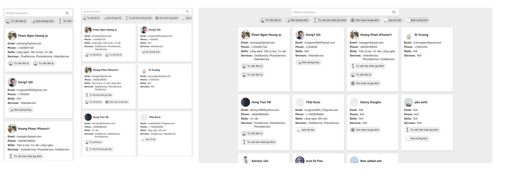

## Search and filter the advisors application

 

### Basic Overview - [Live Demo](https://unitz.tomiez.com)

A small application is instructed by <strong> [Unitz requirements](https://github.com/unitz-co/int-quiz)</strong>. Built upon <strong> create-react-app</strong> with <strong>Typescript</strong> template. UI refers to [Youtube](https://www.youtube.com/) search and filter style. Using <strong> Material-UI</strong> as design system.

#### Features

- Responsive and clean UI
- Search advisors by name by ignoring case, search with the keyboard
- Search advisors by categories with multiple choices
- Theming
- Accessibility and user friendly

#### Technical highlights

- Applied [presentational pattern](https://www.patterns.dev/posts/presentational-container-pattern/) in React for clean code, well-structured and maintained easily
- Using uncontrolled components instead of controlled components to enhance performance
- Immutable, functional programming
- Following React best practices to avoid wasted re-render and unnecessary variables
- Type-safety
- 100% function components and hooks

#### TODO

- Writing tests
- Implement react-window for optimizing long list item render

### Getting started

#### Requirements

- Node.js >= 16.17.0
- yarn >= 1.22.17

```javascript

/* First, Install the needed packages */
yarn install

/* Then start the React app */
yarn start

/* To run the tests */
yarn test

```

#### Author

Hiep Nguyen
tom.hiepnguyen@gmail..com
