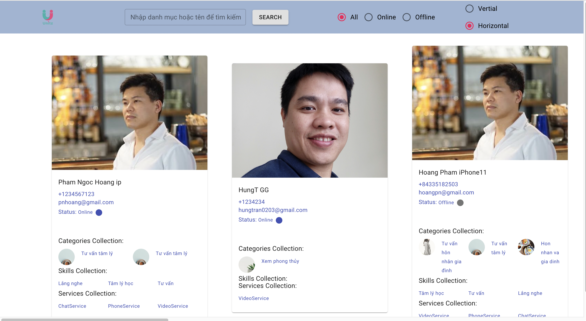
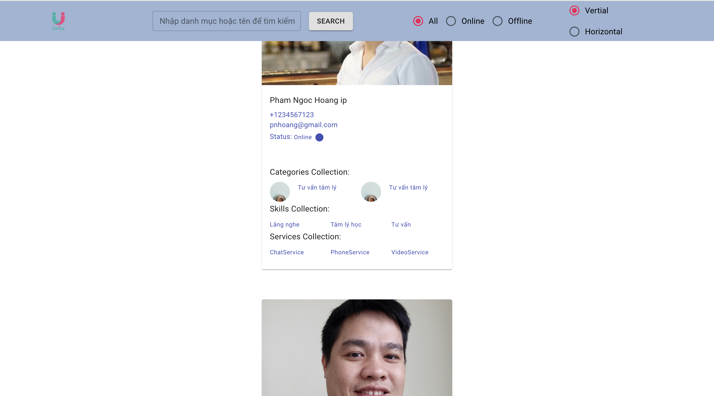
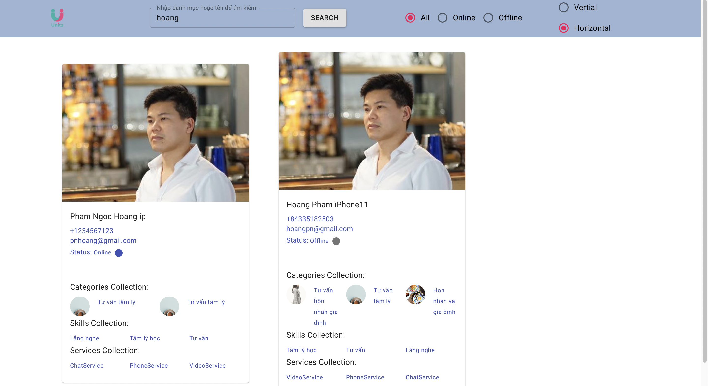
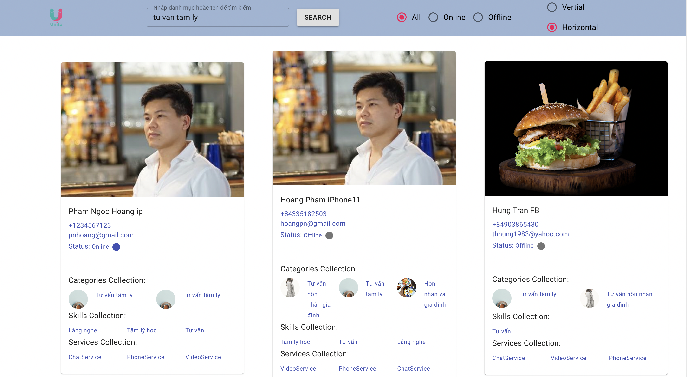
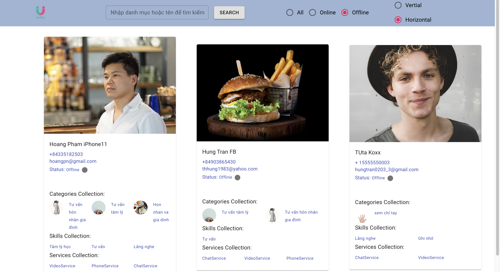
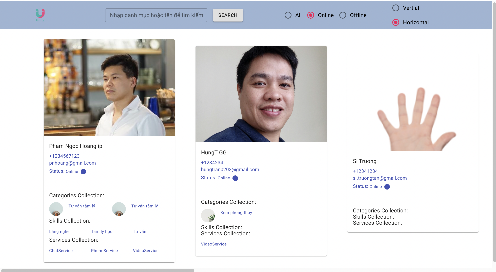

## Available Scripts

In the project directory, you can run:

## Run terminal at unitz-test file

### `npm start || yarn start`

Runs the app in the development mode.\
Open [http://localhost:3000](http://localhost:3000) to view it in your browser.

The page will reload when you make changes.\
You may also see any lint errors in the console.

# HORIZOLTAL VIEW

  
  

# VERTICAL VIEW

  
  

# FILTER BY NAME

  
  

# FILTER BY CATEGORY

  
  

## FILTER OFFLINE STATUS

  
  

## FILTER ONLINE STATUS

  
  

